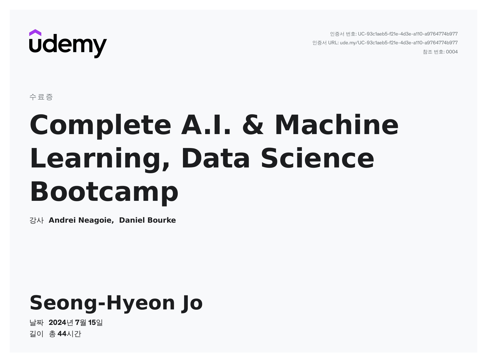

# Complete A.I. & Machine Learning, Data Science Bootcamp
Learn Data Science, Data Analysis, Machine Learning (Artificial Intelligence) and Python with Tensorflow, Pandas & more!

Time: 44hour 

## Complete 2024.07.15

## Content
|     | chapter                                                     | name                                          |
| --- | ----------------------------------------------------------- | --------------------------------------------- |
| 01  | Pandas:Data Analysis                                        | Introduction-to-pandas.ipynb                  |
| 02  | NumPy                                                       | Introduction-to-numpy.ipynb                   |
| 03  | Matplotlib: Plotting and Data Visualization                 | Introduction-to-Matplotlib.ipynb              |
| 04  | Scikit-learn: Creating Machine Learning Models              | Introduction-to-scikit-learn.ipynb            |
| 05  | Milestone Project 1: Supervised Learning (Classification)   | end-to-end-heart-disease-classification.ipynb |
| 06  | Milestone Project 2: Supervised Learning (Time Series Data) | end-to-end-bulldozer-price-regression.ipynb   |